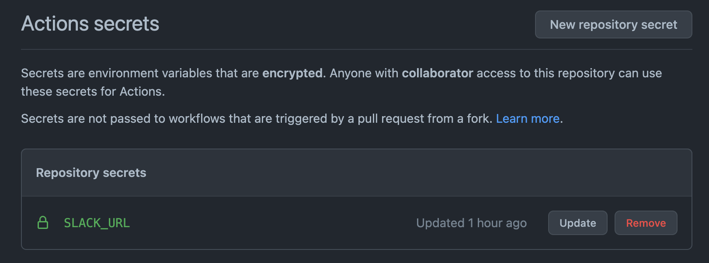
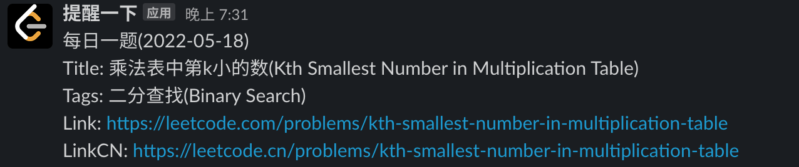

<!-- START doctoc generated TOC please keep comment here to allow auto update -->
<!-- DON'T EDIT THIS SECTION, INSTEAD RE-RUN doctoc TO UPDATE -->
**Table of Contents**  *generated with [DocToc](https://github.com/thlorenz/doctoc)*

- [leetcode-question-today](#leetcode-question-today)
  - [usage](#usage)
  - [效果图](#%E6%95%88%E6%9E%9C%E5%9B%BE)
  - [acknowledgement](#acknowledgement)

<!-- END doctoc generated TOC please keep comment here to allow auto update -->

## leetcode-question-today

leetcode 每日一题推送(目前支持 slack/wecom)

### usage

- fork 此仓库
- Secrets Actions 中添加 SLACK_URL 为对应的 token 即可

- 可自行拓展其他的通知方式

### 效果图

### acknowledgement

- graphql
- leetcode